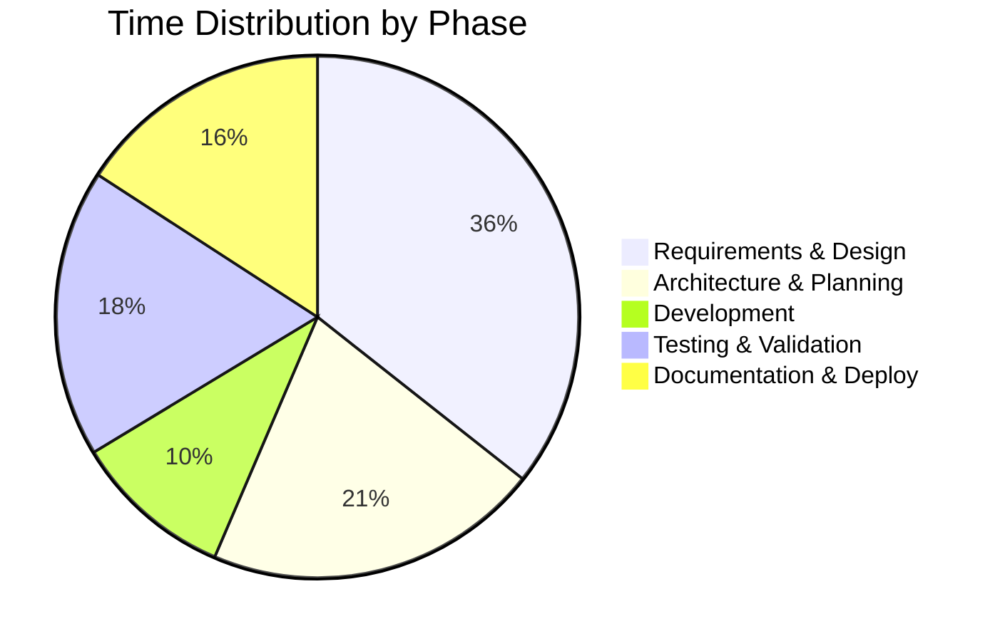
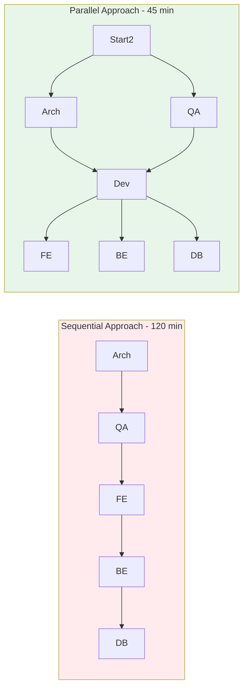
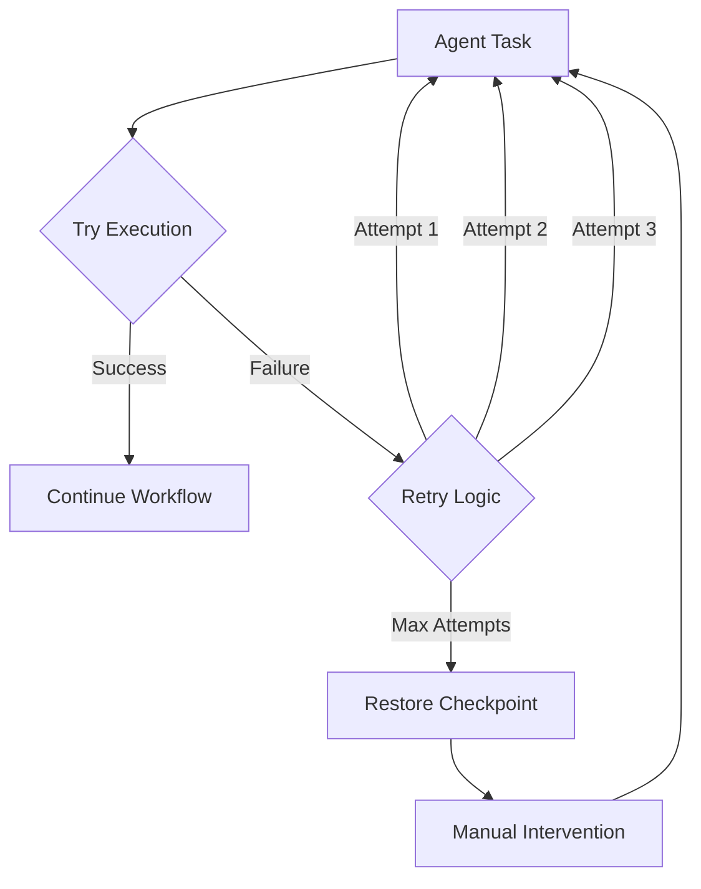

# Claude SDLC Workflow Diagram

## Complete Workflow Visualization

```mermaid
graph TB
    %% Start
    Start([User Story Input]) --> Analyst[Claude Analyst<br/>Generate PRD]
    
    %% PRD Validation
    Analyst --> PRDVal{PRD Validation}
    PRDVal -->|Pass| Designer[Claude Designer<br/>Figma Brief]
    PRDVal -->|Fail| Analyst
    
    %% Design Phase
    Designer --> Manual[Manual Figma Creation]
    Manual --> FigmaLink[Figma Link Added]
    
    %% Parallel Architecture & QA
    FigmaLink --> Parallel1{Parallel Phase 1}
    Parallel1 --> Architect[Claude Architect<br/>System Architecture]
    Parallel1 --> QA[Claude QA<br/>Test Plan Generation]
    
    %% Architecture Approval
    Architect --> HumanApproval{Human Approval<br/>Tech Lead Review}
    HumanApproval -->|Approved| ArchDone[Architecture Ready]
    HumanApproval -->|Rejected| Architect
    
    %% Test Case Generation
    QA --> TestGen[Generate Test Cases]
    
    %% Project Planning
    ArchDone --> Planner[Claude Planner<br/>Task Breakdown]
    TestGen --> Planner
    
    %% Parallel Development
    Planner --> Parallel2{Parallel Phase 2<br/>Development}
    Parallel2 --> FE[Claude FE<br/>Frontend Dev]
    Parallel2 --> BE[Claude BE<br/>Backend Dev]
    Parallel2 --> DBA[Claude DBA<br/>Schema Design]
    
    %% Component Testing
    FE --> FETest[Frontend Tests]
    BE --> BETest[Backend Tests]
    DBA --> DBTest[DB Validation]
    
    %% Security Scanning
    FETest --> SecScan1[Security Scan]
    BETest --> SecScan2[Security Scan]
    DBTest --> SecScan3[Security Scan]
    
    %% QA Validation
    SecScan1 --> QAVal{QA Validation<br/>Against Test Plan}
    SecScan2 --> QAVal
    SecScan3 --> QAVal
    
    %% Validation Results
    QAVal -->|Pass| IntTest[Integration Tests]
    QAVal -->|Fail| Rework[Create Rework Issue]
    Rework --> Parallel2
    
    %% Coverage & Documentation
    IntTest --> Coverage[Coverage Report]
    Coverage -->|> 80%| Docs[Claude Scribe<br/>Generate Docs]
    Coverage -->|< 80%| Parallel2
    
    %% Final Steps
    Docs --> License[License Check]
    License --> Preview[Deploy to Preview]
    Preview --> E2E[E2E Tests]
    E2E -->|Pass| Confluence[Publish to Confluence]
    E2E -->|Fail| Parallel2
    
    %% End
    Confluence --> End([Complete SDLC])
    
    %% Styling
    classDef claude fill:#e1f5fe,stroke:#01579b,stroke-width:2px
    classDef validation fill:#fff3e0,stroke:#e65100,stroke-width:2px
    classDef parallel fill:#f3e5f5,stroke:#4a148c,stroke-width:2px
    classDef human fill:#fce4ec,stroke:#880e4f,stroke-width:2px
    classDef deploy fill:#e8f5e9,stroke:#1b5e20,stroke-width:2px
    
    class Analyst,Designer,Architect,QA,Planner,FE,BE,DBA,Docs claude
    class PRDVal,QAVal,Coverage validation
    class Parallel1,Parallel2 parallel
    class HumanApproval,Manual human
    class Preview,Confluence deploy
```

## Workflow Stages Timeline

```mermaid
gantt
    title Claude SDLC Workflow Timeline
    dateFormat HH:mm
    axisFormat %H:%M
    
    section Requirements
    User Story Input           :done, story, 00:00, 1m
    Generate PRD              :done, prd, after story, 3m
    PRD Validation            :done, prdval, after prd, 1m
    
    section Design
    Generate Figma Brief      :done, brief, after prdval, 2m
    Manual Figma Creation     :active, figma, after brief, 30m
    
    section Architecture & QA
    System Architecture       :arch, after figma, 5m
    Human Approval           :approval, after arch, 10m
    Test Plan Generation     :qa, after figma, 5m
    Generate Test Cases      :tests, after qa, 3m
    
    section Planning
    Task Breakdown           :plan, after approval tests, 3m
    
    section Development
    Frontend Development     :fe, after plan, 10m
    Backend Development      :be, after plan, 10m
    Database Design         :db, after plan, 8m
    
    section Testing
    Component Tests         :ctest, after fe be db, 5m
    Security Scans          :sec, after ctest, 3m
    QA Validation          :qaval, after sec, 5m
    Integration Tests      :int, after qaval, 5m
    
    section Documentation
    Generate Docs          :docs, after int, 5m
    License Check         :lic, after docs, 1m
    
    section Deployment
    Preview Deploy        :preview, after lic, 3m
    E2E Tests            :e2e, after preview, 5m
    Publish Confluence   :conf, after e2e, 2m
```

## Key Workflow Metrics

```mermaid
pie title Time Distribution by Phase
    "Requirements & Design" : 36
    "Architecture & Planning" : 21
    "Development" : 10
    "Testing & Validation" : 18
    "Documentation & Deploy" : 16
```

## Parallel Processing Benefits

```mermaid
graph LR
    subgraph Sequential[Sequential Approach - 120 min]
        A1[Arch] --> A2[QA] --> A3[FE] --> A4[BE] --> A5[DB]
    end
    
    subgraph Parallel[Parallel Approach - 45 min]
        B1[Arch]
        B2[QA]
        B3[FE]
        B4[BE]
        B5[DB]
        
        Start2 --> B1
        Start2 --> B2
        B1 --> Dev
        B2 --> Dev
        Dev --> B3
        Dev --> B4
        Dev --> B5
    end
    
    style Sequential fill:#ffebee
    style Parallel fill:#e8f5e9
```

## Error Handling Flow

```mermaid
graph TD
    Task[Agent Task] --> Try{Try Execution}
    Try -->|Success| Continue[Continue Workflow]
    Try -->|Failure| Retry{Retry Logic}
    Retry -->|Attempt 1| Task
    Retry -->|Attempt 2| Task
    Retry -->|Attempt 3| Task
    Retry -->|Max Attempts| Checkpoint[Restore Checkpoint]
    Checkpoint --> Manual[Manual Intervention]
    Manual --> Task
```